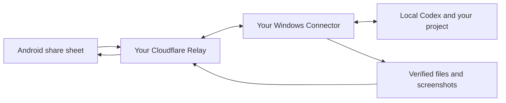

<div align="center">
  
  <h1>A little inspiration. A real next step.</h1>
  <p>Share from your phone. Hand it to your project. Inspect what changed.</p>
  <p><a href="https://droprun.dengmaizi0802.chatgpt.site">Website</a> · <a href="https://github.com/MrMaii/droprun/releases">Downloads</a> · <a href="docs/technical/SELF_HOSTING.md">Self-host</a> · <a href="README.zh-CN.md">简体中文</a></p>
  <p> </p>
</div>

> **Public preview.** This is the first self-hosted release candidate.
> Read the [current validation record](docs/releases/0.5.1-ux.md), including the remaining
> real-device and source-access gates. A polished UI is not proof of reliable execution.

## See the app

<p align="center"></p>

Actual Android app, with labelled demonstration data. This UI tour does not claim a completed source-to-Codex task.

<p align="center">  </p>

[24-second video](https://droprun.dengmaizi0802.chatgpt.site/media/demo.mp4) · [64-second walkthrough](https://droprun.dengmaizi0802.chatgpt.site/media/walkthrough.mp4)

## The short version

You see a useful interaction, screenshot or article on your phone. Share it to
DropRun, pick an existing project, and optionally say what you want. Your Windows
Connector hands it to local Codex. Your phone receives progress and evidence.

**Your code and Codex login stay on your computer.** Your own Cloudflare Relay
handles the handoff and stored results. No DropRun account. No official subscription.

## A smaller handoff

| Share | Work | Inspect |
| --- | --- | --- |
| A compact Android share sheet. Pick a project and leave an optional note. | A new local Codex conversation per share. Follow-ups continue that conversation. | What was actually read, where it applied, what changed and how it was verified. |

- **Project-first history.** Only projects you have used, with independent tasks,
  dispatches and pending work. Retries never inflate the count.
- **A quieter interface.** Light translucent surfaces, lime accents, dark mode,
  accessible controls and motion that respects your settings.
- **Visible boundaries.** Direct execution or plan review; high-risk actions need
  separate approval. Cancelling does not undo changes already made.
- **Evidence over promises.** Screenshots, files and supported static snapshots.
  Live previews are optional and use your own domain/tunnel.

## Get started

You need **Windows x64 + Codex + Git**, **Android 8+**, and **your own Cloudflare
account**. Cloudflare, optional transcription and Codex usage may incur charges.

1. Download the Windows installer or portable archive from [Releases](https://github.com/MrMaii/droprun/releases).
2. Open the local setup guide. Check your tools and deploy your private Relay.
3. Install the Android APK, scan the computer's code and authorize your projects.
4. Share a reference. Check the real status and inspect the report.

[Full setup and recovery guide →](docs/technical/SELF_HOSTING.md)

Windows packages may show an unknown-publisher prompt. Compare published hashes.
The public Android package installs alongside the old private app; it does not
pretend to upgrade a different signing identity.

## How it fits together



The website is an information/download surface, not the task backend. Each Relay
belongs to one owner and one Connector. Multiple phones can pair with it.

## Honest limits

- The computer must be online to execute; accepted work queues while it is away.
- Video-platform access varies. A URL or cover image is not a fully read video.
- Mobile background delivery follows Android's limits; notifications are not an
  unlimited always-on push guarantee.
- Static snapshots support compatible exports, not arbitrary backend-dependent
  apps. Live preview needs a domain and managed tunnel you control.
- Review the [release evidence](docs/releases/0.5.0.md) before important projects.

## Build, contribute, understand

```sh
npm ci
npm test
node scripts/setup.mjs doctor
node scripts/setup.mjs open
```

[Development](docs/technical/DEVELOPMENT.md) · [Architecture](docs/technical/ARCHITECTURE.md)
· [Contracts](docs/technical/CONTRACTS.md) · [Privacy](docs/technical/PRIVACY.md)
· [Contributing](CONTRIBUTING.md) · [Security](SECURITY.md)

DropRun source is [Apache-2.0](LICENSE). Bundled and optional dependencies keep
their own [licenses](THIRD_PARTY_NOTICES.md). Built for people who want a good
reference to become something they can inspect in a real project.
