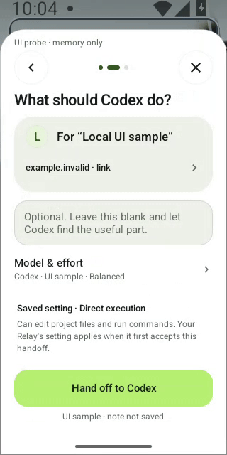
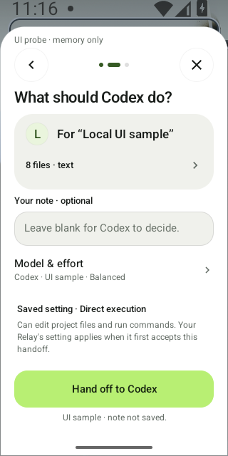
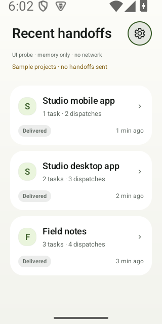
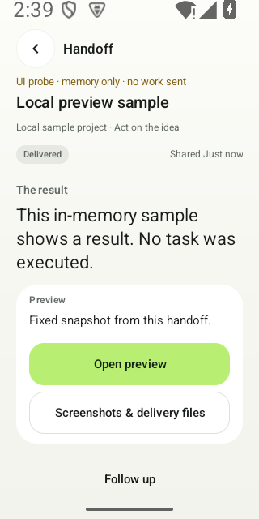
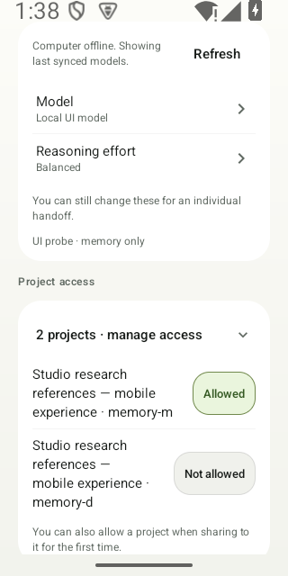
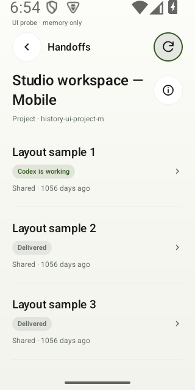
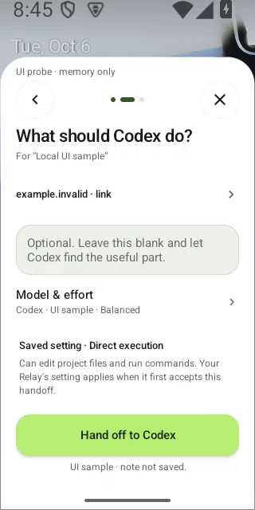

<div align="center">
  
  <p><strong>DropRun</strong> · Android + Windows · Self-hosted</p>
  <h1>Share from your phone.<br>Put local Codex to work.</h1>
  <p>Choose an existing project. Add an optional note. Inspect the result and evidence on your phone.</p>
  <p><a href="docs/technical/SELF_HOSTING.md"><strong>Start installing →</strong></a></p>
  <p>Android 8+ · Windows x64 · signed-in Codex · your Cloudflare</p>
  <p><a href="https://droprun.dengmaizi0802.chatgpt.site">Website</a> · <a href="https://github.com/MrMaii/droprun/releases/tag/v0.5.14-rc.1">Preview downloads</a> · <a href="README.zh-CN.md">简体中文</a></p>
</div>

> **Public preview · 0.5.14-rc.1.** [Validation record and open acceptance gates](docs/releases/0.5.14-rc.1.md).

Codex works on your Windows computer. You deploy the Relay to your own Cloudflare account.

## Check the destination

Return to project selection and adjust the model before sending.
Native memory-only UI; no task sent. [Capture notes](assets/brand/readme-media.md).

<p align="center"><picture><source media="(prefers-reduced-motion: reduce) and (prefers-color-scheme: dark)" srcset="assets/brand/source-share-count-en-dark-20261006.png"><source media="(prefers-reduced-motion: reduce)" srcset="assets/brand/source-share-count-en-light-20261006.png"></picture></p>

<details>
<summary><strong>Recording scope and still images</strong></summary>

[10.49-second original recording](landing/media/native-share-project-tour-en-20261006.mp4) · [Captions](landing/media/native-share-project-tour-en-20261006.vtt)

This excerpt begins after the initial project choice, at original frame18 (1.116322s), and continues to the natural end. Go back, choose again, then select another model.
Native memory-only UI (`0.5.12-dev`, code25); the note stays empty and no task is sent.
Recorded before the always-visible **Your note · optional** label was added; this is not a recording of the signed download.

The excerpt samples the original frames at 25 fps, native 320 × 640: 234 frames, 9.36 seconds. [Complete original GIF](assets/brand/native-share-project-tour-en-20261006.gif). Reduced motion shows the separately captured later development view with the persistent note label and received file counts (after candidate13): [light](assets/brand/source-share-count-en-light-20261006.png) · [dark](assets/brand/source-share-count-en-dark-20261006.png).

[Earlier note view · light](assets/brand/source-share-note-en-light-20261006.png) · [dark](assets/brand/source-share-note-en-dark-20261006.png)

</details>

## Share. Follow. Inspect.

1. **Share → DropRun.** In another Android app, choose an existing project and add an optional note.
2. **Follow local Codex.** Work happens on your computer, in that project. Follow progress and decisions in its history.
3. **Inspect the delivery.** Check the result, required actions, screenshots and files; open the full report when needed.

<details>
<summary><strong>Share, follow and delivery screens</strong></summary>

The screenshots and recordings below are labelled memory-only development UI, not signed-package or genuine Codex recordings. [Capture notes](assets/brand/readme-media.md).

<p align="center">
  <picture><source media="(prefers-color-scheme: dark)" srcset="assets/brand/source-share-count-en-dark-20261006.png"></picture>
  <picture><source media="(prefers-color-scheme: dark)" srcset="assets/brand/source-home-cards-en-dark-20261006.png"></picture>
  <picture><source media="(prefers-color-scheme: dark)" srcset="assets/brand/source-delivery-artifacts-en-dark-20261007.png"></picture>
</p>

</details>

Tasks count independent requests; dispatches count accepted shares and follow-ups.
Network retries add neither.

For example, share a design reference to an existing app project with this note:

> Adapt this navigation idea to our settings screen. Keep our existing visual style.

<details>
<summary><strong>Settings and project history</strong></summary>

Settings in one place. Handoff history organized by project.

<p align="center">
  <picture><source media="(prefers-color-scheme: dark)" srcset="assets/brand/source-settings-access-en-dark-20261007.png"></picture>
  <picture><source media="(prefers-color-scheme: dark)" srcset="assets/brand/source-history-hierarchy-en-dark-20261006.png"></picture>
</p>

Normal-font memory-only examples: Settings shows a scrolled model/access section; history has three sample rows. These are not 200% text captures.

</details>

<details>
<summary><strong>Earlier Share layout · 9.06-second recording</strong></summary>

Memory-only development UI; preset project, empty note, no task sent. This earlier layout predates the project-and-material confirmation group.

<p align="center"><picture><source media="(prefers-reduced-motion: reduce) and (prefers-color-scheme: dark)" srcset="assets/brand/source-share-plain-en-dark-20261006.png"><source media="(prefers-reduced-motion: reduce)" srcset="assets/brand/source-share-plain-en-light-20261006.png"></picture></p>

[9.06-second original recording](landing/media/native-share-reading-en-20261006.mp4) · [Captions](landing/media/native-share-reading-en-20261006.vtt)

[Light still](assets/brand/source-share-plain-en-light-20261006.png) · [Dark still](assets/brand/source-share-plain-en-dark-20261006.png).
The earlier GIF remains a 25 fps sampled display at native 320 × 640; its MP4 keeps the original timeline.

</details>

<details>
<summary><strong>Earlier UI tours and longer walkthrough</strong></summary>

The October 5 tours use the 0.5.1 development UI with labelled demonstration data.
They show interface navigation, not a completed source-to-Codex task.

[Earlier 9-second tour](https://droprun.dengmaizi0802.chatgpt.site/media/ui-tour-en.mp4) · [24-second video](https://droprun.dengmaizi0802.chatgpt.site/media/demo.mp4) · [64-second walkthrough](https://droprun.dengmaizi0802.chatgpt.site/media/walkthrough.mp4)

</details>

**[Set up DropRun →](docs/technical/SELF_HOSTING.md)**

## Start with your own setup

| Computer | Phone | Relay |
| --- | --- | --- |
| Windows x64, Git, signed-in Codex, Chrome or Edge | Android 8 or newer | Your Cloudflare account with Workers, D1 and R2 |

1. **Install on Windows.** Get the [installer](https://github.com/MrMaii/droprun/releases/download/v0.5.14-rc.1/DropRun-0.5.14-windows-x64-setup.exe) or [portable ZIP](https://github.com/MrMaii/droprun/releases/download/v0.5.14-rc.1/DropRun-0.5.14-windows-x64.zip).
   For the portable edition, extract to a permanent folder and open `DropRun.cmd`.
2. **Set up your Relay.** Open the local browser guide, check prerequisites and
   deploy to your own Cloudflare account.
3. **Pair your phone.** Install the [Android APK](https://github.com/MrMaii/droprun/releases/download/v0.5.14-rc.1/DropRun-0.5.14-android.apk), scan the computer's code, confirm the server and authorize projects.
4. **Make a handoff.** In another Android app, tap **Share → DropRun** and choose
   a project. Follow receipt, execution and
   approval through to the report. “Saved” means saved on your phone, not finished.

**[Complete installation, recovery and upgrade guide →](docs/technical/SELF_HOSTING.md)**

DropRun has no official account or subscription. Cloudflare, optional
transcription and Codex usage belong to your accounts and **may incur charges**.
Windows packages are unsigned and may show an unknown-publisher prompt; compare
the release [checksums](https://github.com/MrMaii/droprun/releases/download/v0.5.14-rc.1/SHA256SUMS.txt).
The public Android app installs alongside the historical private/debug app;
different signing identities cannot silently replace each other.

## Made for a small handoff

- **Keep the intent.** Your note leads the task. Each independent share starts a
  new Codex conversation; a follow-up continues the same one.
- **Stay oriented.** Home shows only projects with handoff history or locally saved shares.
- **Decide how work starts.** Choose direct execution or plan review. Project
  permissions and approval for high-risk actions remain separate.
- **Inspect what happened.** Reports distinguish actual source coverage, project
  changes and verification. Delivery can include screenshots, files and supported
  static snapshots; live preview is optional.

## Your phone. Your computer. Your Relay.

<p align="center"><picture><source media="(prefers-color-scheme: dark)" srcset="assets/brand/readme-architecture-dark.svg"></picture></p>

References and notes: Android → your Relay → Windows Connector → local Codex.
Progress, reports and delivery files: Connector → Relay → Android.

Project code and Codex login stay on your computer. Shared material, reports and
uploaded artifacts pass through your own Cloudflare instance. Each Relay belongs
to one owner and one Connector; multiple phones can pair with it. The public
website provides information and downloads. [Data and privacy →](docs/technical/PRIVACY.md)

## Know the boundaries

- **An online computer does the work.** Accepted handoffs queue while it is away.
- **Source access varies.** A video URL, cover or transcript does not establish
  full video coverage. Read the report's actual extraction scope.
- **Android controls background delivery.** Notifications are not an unlimited
  always-on push guarantee.
- **Preview depends on the project.** Static snapshots need compatible exports.
  Live preview needs your own domain, managed tunnel and online computer.
- **Cancellation is not a rollback.** Cancelling a task or deleting its cloud
  record does not undo changes already made to your project.

This is a release candidate. Physical Android performance, clean Windows
installation and the full real-source handoff workflow still have open acceptance
gates. See the [dated validation record](docs/releases/0.5.14-rc.1.md) before using
it on important projects. Screenshots and a UI tour do not establish those results.

## Build and contribute

Start with Node.js 24 and Git. Android development also needs JDK 17+ and Android
SDK 35; the [development guide](docs/technical/DEVELOPMENT.md) covers builds and tools.

```sh
npm ci
npm test
node scripts/setup.mjs doctor
node scripts/setup.mjs open
```

[Architecture](docs/technical/ARCHITECTURE.md) · [Contracts](docs/technical/CONTRACTS.md)
· [Contributing](CONTRIBUTING.md) · [Security](SECURITY.md)

Source: [Apache-2.0](LICENSE). Bundled and optional dependencies retain their
own [licenses](THIRD_PARTY_NOTICES.md).
