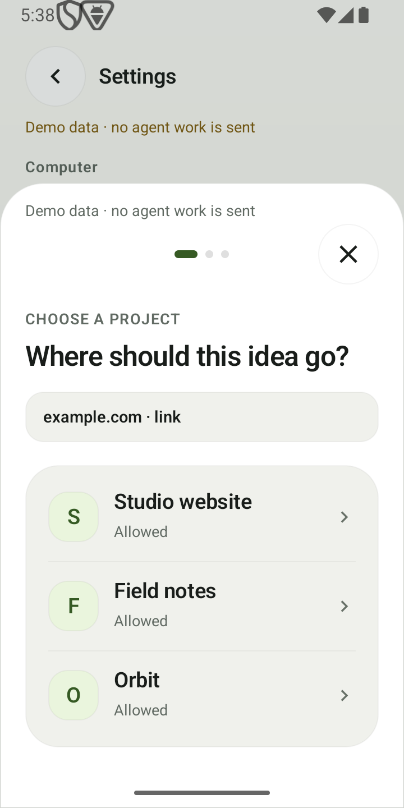
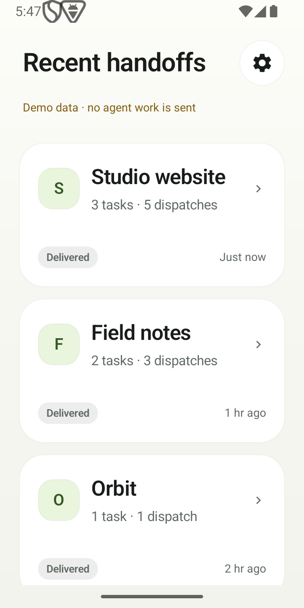
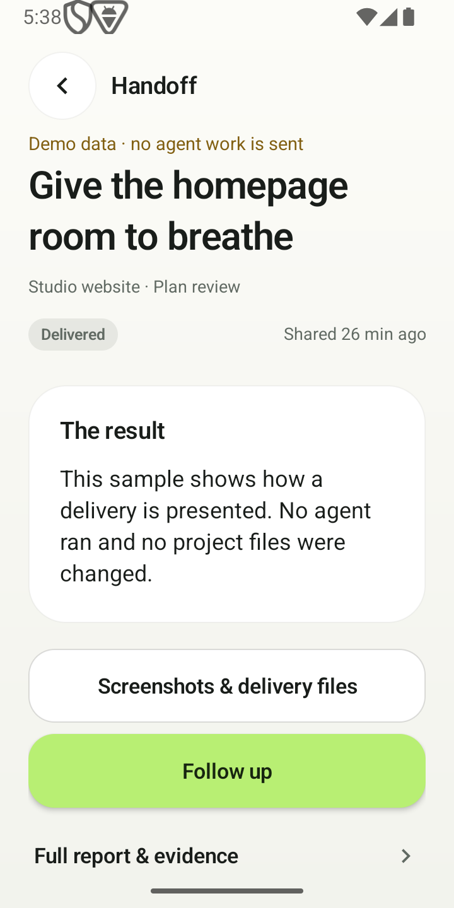
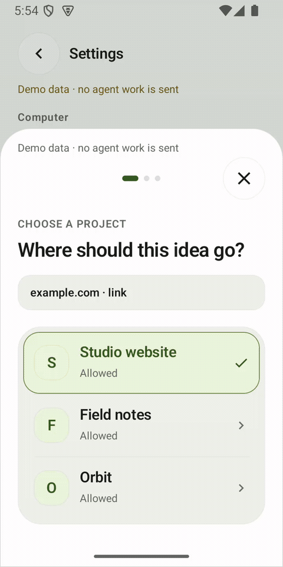

<div align="center">
  
  <h1>DropRun</h1>
  <p><strong>Share from your phone. Put local Codex to work.</strong></p>
  <p>An Android share sheet for your existing projects on Windows.<br>Self-hosted on your Cloudflare. Results you can inspect.</p>
  <p><a href="docs/technical/SELF_HOSTING.md"><strong>Get started →</strong></a> &nbsp; · &nbsp; <a href="https://droprun.dengmaizi0802.chatgpt.site">Website</a> &nbsp; · &nbsp; <a href="https://github.com/MrMaii/droprun/releases/tag/v0.5.3-rc.1">Downloads</a> &nbsp; · &nbsp; <a href="README.zh-CN.md">简体中文</a></p>
</div>

> **Public preview · 0.5.3-rc.1.** [Validation record and open acceptance gates](docs/releases/0.5.3-rc.1.md).

You find a useful interaction, screenshot or article on your phone. Share it to
DropRun, choose a project, and optionally leave a note. Your Windows Connector
hands the reference and intent to local Codex. Come back to progress, a report,
and evidence of what changed.

## Share. Choose. Inspect.

**UI demonstration only:** nothing was sent to an agent, and the report uses
labelled sample data.

<table>
  <tr>
    <th align="center">01 · Share a reference</th>
    <th align="center">02 · Keep it with the project</th>
    <th align="center">03 · Inspect the delivery</th>
  </tr>
  <tr>
    <td align="center"><picture><source media="(prefers-color-scheme: dark)" srcset="assets/brand/readme-share-dark.png"></picture></td>
    <td align="center"><picture><source media="(prefers-color-scheme: dark)" srcset="assets/brand/readme-home-dark.png"></picture></td>
    <td align="center"><picture><source media="(prefers-color-scheme: dark)" srcset="assets/brand/readme-task-dark.png"></picture></td>
  </tr>
  <tr>
    <td>Pick an existing project. Add a note when you have a specific change in mind.</td>
    <td>Tasks count independent requests; dispatches count accepted shares and follow-ups. Network retries add neither.</td>
    <td>See the result, required actions, screenshots and files. Open the full report when needed.</td>
  </tr>
</table>

Screens and tours show the 0.5.1 development UI captured October 5, 2026 with labelled demo data. They predate the later UX refinements and are not recordings of the 0.5.3-rc.1 download.
[Capture notes](assets/brand/readme-media.md).

<p align="center"></p>

[9-second native UI video](https://droprun.dengmaizi0802.chatgpt.site/media/ui-tour-en.mp4) · [Captions](landing/media/ui-tour-en.vtt)

<details>
<summary><strong>Earlier preview tour and longer walkthrough</strong></summary>

<p align="center"></p>

These videos and this animation are from the earlier preview. They show the interface, not a completed
source-to-Codex task.

[24-second video](https://droprun.dengmaizi0802.chatgpt.site/media/demo.mp4) · [64-second walkthrough](https://droprun.dengmaizi0802.chatgpt.site/media/walkthrough.mp4)

</details>

## Made for a small handoff

- **Keep the intent.** Your note leads the task. Each independent share starts a
  new Codex conversation; a follow-up continues the same one.
- **Stay oriented.** Home shows only projects with handoff history or locally saved shares.
  Task and dispatch counts exclude network retries.
- **Decide how work starts.** Choose direct execution or plan review. Project
  permissions and approval for high-risk actions remain separate.
- **Inspect what happened.** Reports distinguish actual source coverage, project
  changes and verification. Delivery can include screenshots, files and supported
  static snapshots; live preview is optional.

## Start with your own setup

| Computer | Phone | Relay |
| --- | --- | --- |
| Windows x64, Git, signed-in Codex, Chrome or Edge | Android 8 or newer | Your Cloudflare account with Workers, D1 and R2 |

1. **Install on Windows.** Get the [installer](https://github.com/MrMaii/droprun/releases/download/v0.5.3-rc.1/DropRun-0.5.3-windows-x64-setup.exe) or [portable ZIP](https://github.com/MrMaii/droprun/releases/download/v0.5.3-rc.1/DropRun-0.5.3-windows-x64.zip).
   For the portable edition, extract to a permanent folder and open `DropRun.cmd`.
2. **Set up your Relay.** Open the local browser guide, check prerequisites and
   deploy to your own Cloudflare account.
3. **Pair your phone.** Install the [Android APK](https://github.com/MrMaii/droprun/releases/download/v0.5.3-rc.1/DropRun-0.5.3-android.apk), scan the computer's code, confirm the server and authorize projects.
4. **Make a handoff.** Share a reference, then follow receipt, execution and
   approval through to the report. “Saved” means saved on your phone, not finished.

**[Complete installation, recovery and upgrade guide →](docs/technical/SELF_HOSTING.md)**

DropRun has no official account or subscription. Cloudflare, optional
transcription and Codex usage belong to your accounts and **may incur charges**.
Windows packages are unsigned and may show an unknown-publisher prompt; compare
the release [checksums](https://github.com/MrMaii/droprun/releases/download/v0.5.3-rc.1/SHA256SUMS.txt).
The public Android app installs alongside the historical private/debug app;
different signing identities cannot silently replace each other.

## Your phone. Your computer. Your Relay.

<picture><source media="(prefers-color-scheme: dark)" srcset="assets/brand/readme-architecture-dark.svg"></picture>

References and notes: Android → your Relay → Windows Connector → local Codex.
Progress, reports and delivery files: Connector → Relay → Android.

Project code and Codex login stay on your computer. Shared material, reports and
uploaded artifacts pass through your own Cloudflare instance. Each Relay belongs
to one owner and one Connector; multiple phones can pair with it. The public
website provides information and downloads. [Data and privacy →](docs/technical/PRIVACY.md)

## Know the boundaries

- **An online computer does the work.** Accepted handoffs queue while it is away.
- **Source access varies.** A video URL, cover or transcript does not establish
  full video coverage. Read the report's actual extraction scope.
- **Android controls background delivery.** Notifications are not an unlimited
  always-on push guarantee.
- **Preview depends on the project.** Static snapshots need compatible exports.
  Live preview needs your own domain, managed tunnel and online computer.
- **Cancellation is not a rollback.** Cancelling a task or deleting its cloud
  record does not undo changes already made to your project.

This is a release candidate. Physical Android performance, clean Windows
installation and the full real-source handoff workflow still have open acceptance
gates. See the [dated validation record](docs/releases/0.5.3-rc.1.md) before using
it on important projects. Screenshots and a UI tour do not establish those results.

## Build and contribute

Start with Node.js 24 and Git. Android development also needs JDK 17+ and Android
SDK 35; the [development guide](docs/technical/DEVELOPMENT.md) covers builds and tools.

```sh
npm ci
npm test
node scripts/setup.mjs doctor
node scripts/setup.mjs open
```

[Architecture](docs/technical/ARCHITECTURE.md) · [Contracts](docs/technical/CONTRACTS.md)
· [Contributing](CONTRIBUTING.md) · [Security](SECURITY.md)

Source: [Apache-2.0](LICENSE). Bundled and optional dependencies retain their
own [licenses](THIRD_PARTY_NOTICES.md).
