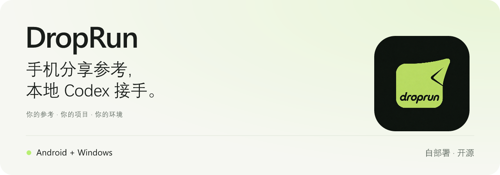
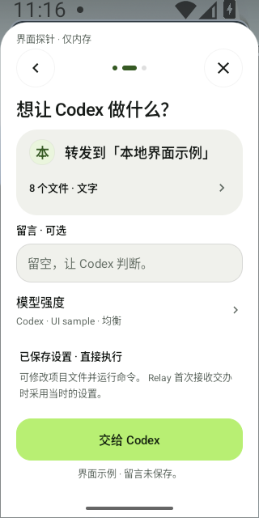
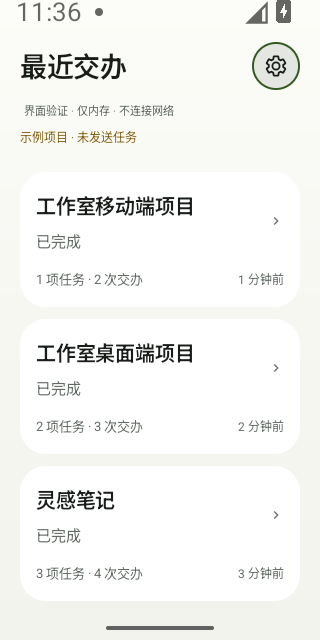
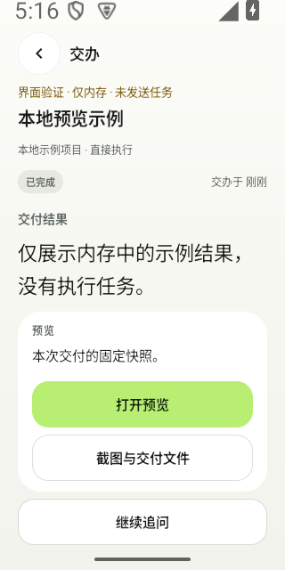
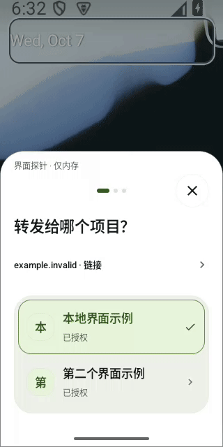
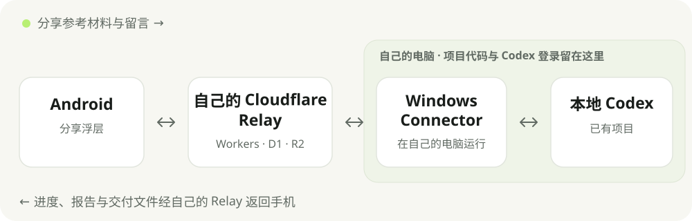

<div align="center">
  <picture><source media="(max-width: 600px) and (prefers-color-scheme: dark)" srcset="assets/brand/readme-cover-zh-dark-compact.png"><source media="(max-width: 600px)" srcset="assets/brand/readme-cover-zh-light-compact.png"><source media="(prefers-color-scheme: dark)" srcset="assets/brand/readme-cover-zh-dark.png"></picture>
  <p>把链接、文字或文件分享给已有项目，可选留一句话，在手机查看结果与证据。</p>
  <p><a href="docs/technical/SELF_HOSTING.zh-CN.md"><strong>开始安装 →</strong></a></p>
  <p>Android 8+ · Windows x64 · 已登录 Codex · 自己的 Cloudflare</p>
  <p><a href="https://droprun.dengmaizi0802.chatgpt.site/zh/">官网</a> · <a href="https://github.com/MrMaii/droprun/releases/tag/v0.5.16-rc.1">候选版下载</a> · <a href="README.md">English</a></p>
</div>

> **公开预览 · 0.5.16-rc.1。** [实际验证记录与待通过的验收门槛](docs/releases/0.5.16-rc.1.md)。

Codex 在你的 Windows 电脑上工作，Relay 由你部署到自己的 Cloudflare 账号。

## 分享、跟进、查看

1. **分享 → DropRun。** 在其他 Android App 分享，选已有项目，按需补充留言。
2. **跟进本地 Codex。** Codex 在你的电脑和所选项目中工作。按项目查看进展与待确认事项。
3. **查看交付。** 检查结果、需要处理的动作、截图和文件，再按需展开报告。

截图与录屏为单独采集、明确标注的原生内存示例，并非真实交办或签名下载包录制。[媒体来源与录制范围](assets/brand/readme-media.md)。

<p align="center">
  <picture><source media="(prefers-color-scheme: dark)" srcset="assets/brand/source-share-count-zh-dark-20261006.png"></picture>
  <picture><source media="(prefers-color-scheme: dark)" srcset="assets/brand/source-home-status-zh-dark-20261007.png"></picture>
  <picture><source media="(prefers-color-scheme: dark)" srcset="assets/brand/source-delivery-followup-zh-dark-20261007.png"></picture>
</p>

<p align="center"><strong>01 · 分享参考</strong> &nbsp; · &nbsp; <strong>02 · 跟进项目</strong> &nbsp; · &nbsp; <strong>03 · 查看结果</strong></p>

任务数统计独立请求；交办次数统计已接收的分享与追问。网络重试不增加次数。

例如，把一条设计参考分享给已有的 App 项目，留言：

> 借鉴这里的导航思路，改进我们的设置页。保持现有视觉风格。

### 观看分享交互

发送前，返回并改选另一个项目，再把推理强度从深入改为均衡。

<p align="center"><picture><source media="(prefers-reduced-motion: reduce) and (prefers-color-scheme: dark)" srcset="assets/brand/source-share-count-zh-dark-20261006.png"><source media="(prefers-reduced-motion: reduce)" srcset="assets/brand/source-share-count-zh-light-20261006.png"></picture></p>

[原始录屏](landing/media/native-share-touch-zh-20261007.mp4) · [字幕](landing/media/native-share-touch-zh-20261007.vtt)

**[开始安装与配对 →](docs/technical/SELF_HOSTING.zh-CN.md)**

## 从自己的环境开始

| 电脑 | 手机 | 中转 |
| --- | --- | --- |
| Windows x64、Git、已登录 Codex、Chrome 或 Edge | Android 8 或更新版本 | 自己的 Cloudflare 账号，启用 Workers、D1、R2 |

1. **安装电脑端。** 下载 [Windows 安装包](https://github.com/MrMaii/droprun/releases/download/v0.5.16-rc.1/DropRun-0.5.16-windows-x64-setup.exe)或[便携 ZIP](https://github.com/MrMaii/droprun/releases/download/v0.5.16-rc.1/DropRun-0.5.16-windows-x64.zip)。
   便携版解压到固定位置后，运行 `DropRun.cmd`。
2. **部署自己的 Relay。** 打开本机浏览器向导，检查环境，部署到自己的 Cloudflare 账号。
3. **配对手机。** 安装 [Android APK](https://github.com/MrMaii/droprun/releases/download/v0.5.16-rc.1/DropRun-0.5.16-android.apk)，扫码确认电脑与服务器，再授权项目。
4. **发出第一项交办。** 在其他 Android App 点 **分享 → DropRun**，选择项目，跟进接收、执行、审批与报告。“已保存”表示手机已保存，
   不表示任务已完成。

**[完整安装、恢复和升级指南 →](docs/technical/SELF_HOSTING.zh-CN.md)**

DropRun 没有官方账号或订阅。Cloudflare、可选转写和 Codex 使用你自己的账号，
**用量可能产生费用**。Windows 包未签名，可能提示未知发布者，请对照发布的
[校验值](https://github.com/MrMaii/droprun/releases/download/v0.5.16-rc.1/SHA256SUMS.txt)。
公共 Android 版与历史私人/debug 版并行安装，不尝试跨签名覆盖。

## 让一次交办更顺手

- **保留你的意图。** 留言是任务的主要目标。独立分享创建新 Codex 会话，追问继续原会话。
- **按项目找回来。** 首页只展示交办过或有待发送记录的项目。
- **决定怎么开工。** 直接执行或先看计划；项目权限与高风险动作的审批各自独立。
- **检查实际发生了什么。** 报告区分材料读取范围、项目改动与验证。交付可包含截图、文件
  和支持的静态快照；实时预览按需配置。

## 你的手机、电脑与 Relay

<p align="center"><picture><source media="(prefers-color-scheme: dark)" srcset="assets/brand/readme-architecture-zh-dark.svg"></picture></p>

参考材料与留言：Android → 自己的 Relay → Windows Connector → 本地 Codex。
进度、报告与交付文件：Connector → Relay → Android。

Codex 在你的电脑上处理项目，登录信息保留本机。提交材料、报告与上传产物经过
你自己的 Cloudflare，报告或产物可能包含代码。
一套 Relay 对应一个所有者与一台 Connector，可配对多个手机。官网提供产品说明与下载。
[数据去向与隐私 →](docs/technical/PRIVACY.md)

## 了解能力边界

- **电脑在线才执行。** 已被 Relay 接收的交办在电脑离线时排队。
- **来源读取有范围。** 链接、封面或字幕不代表完整读完视频，以报告记录的实际读取范围为准。
- **后台接收受系统管理。** Android 通知不是无限实时推送的保证。
- **预览取决于项目。** 静态快照需要兼容导出；实时预览需要自己的域名、managed Tunnel
  和在线电脑。
- **取消不等于回滚。** 取消任务或删除云端记录，不会撤销项目里已经发生的改动。

当前仍为候选版。实体 Android 性能、干净 Windows 安装与真实来源完整交办仍有待通过的
验收门槛。重要项目使用前，请阅读[带日期的验证记录](docs/releases/0.5.16-rc.1.md)。
截图与界面动图不能代替这些结果。

## 开发与贡献

准备 Node.js 24 和 Git。Android 开发还需要 JDK 17+ 与 Android SDK 35；
构建步骤与工具要求见[开发指南](docs/technical/DEVELOPMENT.md)。

```sh
npm ci
npm test
node scripts/setup.mjs doctor
node scripts/setup.mjs open
```

[架构](docs/technical/ARCHITECTURE.md) · [协议](docs/technical/CONTRACTS.md)
· [贡献](CONTRIBUTING.md) · [安全反馈](SECURITY.md)

源码采用 [Apache-2.0](LICENSE)。随包及可选依赖保留[各自许可](THIRD_PARTY_NOTICES.md)。
