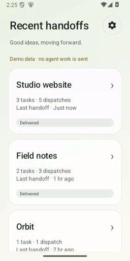
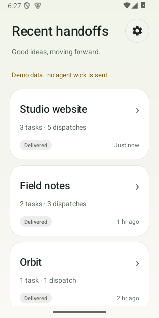
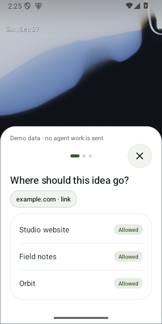
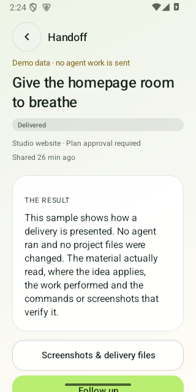

<div align="center">
  
  <h1>你转发，它开工。</h1>
  <p>把手机里的灵感，交给已有项目。</p>
  <p><a href="https://droprun.dengmaizi0802.chatgpt.site/zh/">官网</a> · <a href="https://github.com/MrMaii/droprun/releases">下载</a> · <a href="docs/technical/SELF_HOSTING.zh-CN.md">自部署指南</a> · <a href="README.md">English</a></p>
</div>

> **公开预览版 0.5.1-rc.2。** [当前验证记录](docs/releases/0.5.1-rc.2.md)列出实际验证与尚未通过的门槛。
> 真机、真实来源与完整可靠性验证不能由截图代替。

## 看看实际界面

<p align="center"></p>

真实 Android 客户端，使用明确标注的演示数据。本段展示界面，不冒充真实来源到 Codex 的完整任务。

动图来自较早预览版；下方截图来自 9 月 27 日的本地 0.5.1 原生客户端，使用演示数据。

<p align="center">  </p>

[24-second video](https://droprun.dengmaizi0802.chatgpt.site/media/demo.mp4) · [64-second walkthrough](https://droprun.dengmaizi0802.chatgpt.site/media/walkthrough.mp4)

## 一次交办，接着做

看到有用的交互、图片、视频或文章，分享到 DropRun，选已有项目，可选留一句话。
Windows Connector 让本地 Codex 结合项目工作，手机查看进度与交付证据。

**代码和 Codex 登录留在电脑，Relay 部署在你自己的 Cloudflare。** 没有官方账号，
没有官方订阅；供应商用量仍可能产生费用。

- **项目优先：** 只显示交办过的项目，独立任务、交办次数与待发送状态清楚分开。
- **自然顺手：** 浅色通透、青柠点缀、深色模式和轻量分享浮层，支持减少动画。
- **授权清楚：** 直接执行或先看计划，高风险动作单独批准；取消不会回滚已有修改。
- **结果可查：** 实际读取范围、应用判断、真实改动、截图、文件和支持的静态预览。

## 开始使用

准备 Windows x64、Git、已登录 Codex、Android 8+ 和启用所需服务的 Cloudflare。

1. 从[发布页](https://github.com/MrMaii/droprun/releases)下载 Windows 安装包或便携版。
2. 打开本机向导，检查环境，部署自己的 Relay。
3. 安装 Android APK，扫码确认服务器和电脑，授权项目。
4. 分享参考，查看真实状态和最终报告。

[完整安装、恢复和升级指南](docs/technical/SELF_HOSTING.zh-CN.md)

Windows 未签名包可能提示未知发布者，请核对校验值。公共 Android 包与旧私人版
并行安装，不尝试跨签名覆盖。

## 能力边界

- 电脑离线时排队，上线后才执行。
- 视频读取取决于来源权限与可用内容，不能把链接、封面或字幕当作完整视频。
- 手机后台接收受 Android 系统限制，不承诺无限实时推送。
- 静态预览支持兼容的导出页面；实时后端预览需自己的域名与 managed Tunnel。
- 每次分享创建独立任务；追问复用会话；网络重试不增加交办次数。

## 开发与贡献

```sh
npm ci
npm test
node scripts/setup.mjs doctor
node scripts/setup.mjs open
```

[开发说明](docs/technical/DEVELOPMENT.md) · [架构](docs/technical/ARCHITECTURE.md)
· [协议](docs/technical/CONTRACTS.md) · [隐私](docs/technical/PRIVACY.md)
· [贡献](CONTRIBUTING.md) · [安全反馈](SECURITY.md)

源码采用 [Apache-2.0](LICENSE)。第三方程序保留[各自许可](THIRD_PARTY_NOTICES.md)。
