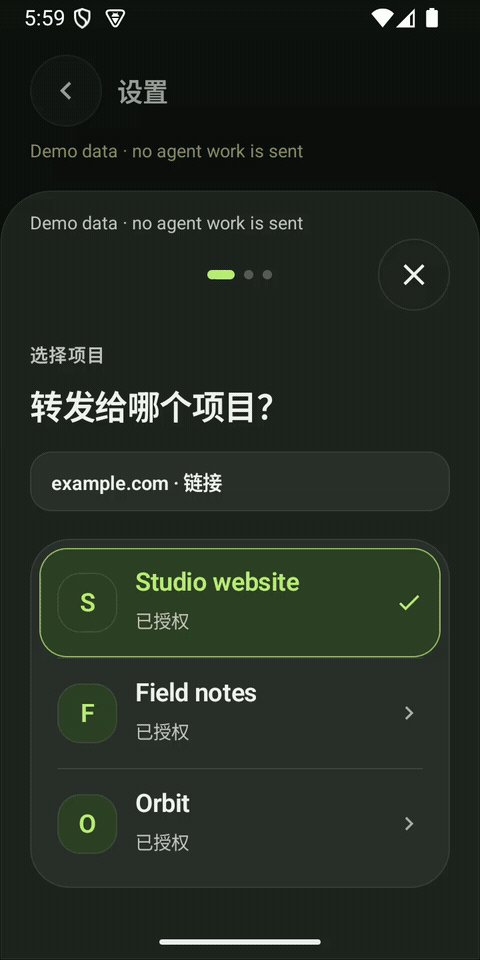
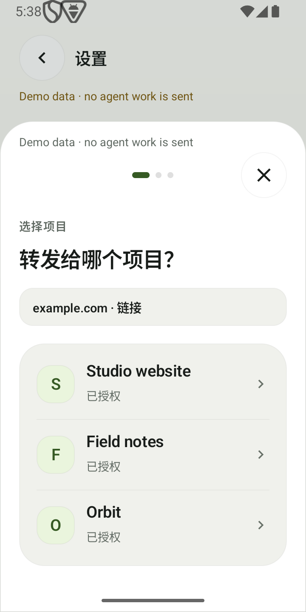
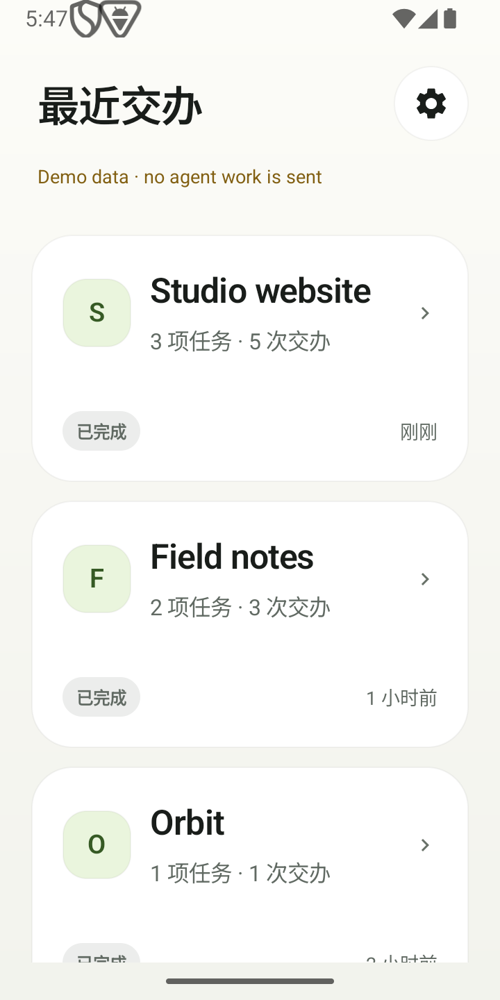
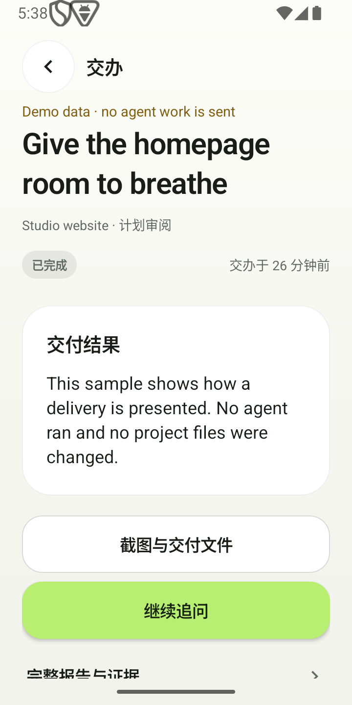
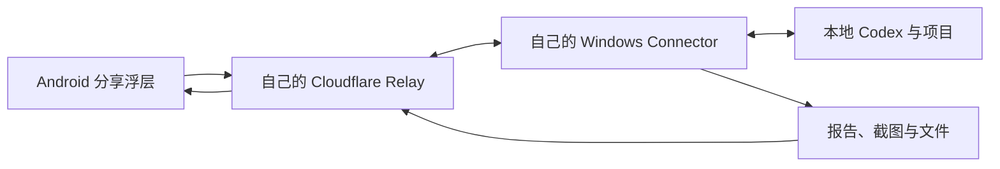

<div align="center">
  
  <h1>DropRun</h1>
  <p><strong>手机里的好参考，交给电脑里的项目。</strong></p>
  <p>从 Android 分享材料，让 Windows 上的本地 Codex 接着做。<br>部署在自己的 Cloudflare，回来查看结果与证据。</p>
  <p><a href="docs/technical/SELF_HOSTING.zh-CN.md"><strong>开始安装 →</strong></a> &nbsp; · &nbsp; <a href="https://droprun.dengmaizi0802.chatgpt.site/zh/">官网</a> &nbsp; · &nbsp; <a href="https://github.com/MrMaii/droprun/releases/tag/v0.5.2-rc.1">下载</a> &nbsp; · &nbsp; <a href="README.md">English</a></p>
</div>

> **公开预览 · 0.5.2-rc.1。** [实际验证记录与待通过的验收门槛](docs/releases/0.5.2-rc.1.md)。

手机里看到有用的交互、截图或文章，分享到 DropRun，选一个已有项目，可选留一句话。
Windows Connector 把参考与意图交给本地 Codex。回来查看进度、报告和改动证据。

## 分享、归项目、看交付

**仅演示界面：** 没有向 agent 发送任务，报告使用明确标注的示例数据。

<p align="center"></p>

[12 秒原生界面视频](https://droprun.dengmaizi0802.chatgpt.site/media/ui-tour-zh.mp4) · [字幕](landing/media/ui-tour-zh.vtt)

<table>
  <tr>
    <th align="center">01 · 分享参考</th>
    <th align="center">02 · 留在项目里</th>
    <th align="center">03 · 查看交付</th>
  </tr>
  <tr>
    <td align="center"><picture><source media="(prefers-color-scheme: dark)" srcset="assets/brand/readme-share-zh-dark.png"></picture></td>
    <td align="center"><picture><source media="(prefers-color-scheme: dark)" srcset="assets/brand/readme-home-zh-dark.png"></picture></td>
    <td align="center"><picture><source media="(prefers-color-scheme: dark)" srcset="assets/brand/readme-task-zh-dark.png"></picture></td>
  </tr>
  <tr>
    <td>选已有项目。有明确想法时，留一句希望完成的改动。</td>
    <td>按项目查看最近交办与统计，分清任务、追问与待发送记录。</td>
    <td>先看结果、需要处理的动作、截图和文件，再按需展开报告。</td>
  </tr>
</table>

截图来自 2026 年 10 月 5 日的 0.5.1 原生开发界面。0.5.2-rc.1 候选包已包含本轮界面重构。
[媒体来源说明](assets/brand/readme-media.md)。

<details>
<summary><strong>较早预览版动图与完整界面导览</strong></summary>

<p align="center"></p>

以下动图与视频来自较早预览版，展示界面交互，不代表真实来源到 Codex 的完整交办。

[24 秒短演示](https://droprun.dengmaizi0802.chatgpt.site/media/demo.mp4) · [64 秒界面导览](https://droprun.dengmaizi0802.chatgpt.site/media/walkthrough.mp4)

</details>

## 让一次交办更顺手

- **保留你的意图。** 留言是任务的主要目标。独立分享创建新 Codex 会话，追问继续原会话。
- **按项目找回来。** 首页只展示交办过或有待发送记录的项目。任务与交办次数不计入网络重试。
- **决定怎么开工。** 直接执行或先看计划；项目权限与高风险动作的审批各自独立。
- **检查实际发生了什么。** 报告区分材料读取范围、项目改动与验证。交付可包含截图、文件
  和支持的静态快照；实时预览按需配置。

## 从自己的环境开始

| 电脑 | 手机 | 中转 |
| --- | --- | --- |
| Windows x64、Git、已登录 Codex、Chrome 或 Edge | Android 8 或更新版本 | 自己的 Cloudflare 账号，启用 Workers、D1、R2 |

1. **安装电脑端。** 下载 [Windows 安装包](https://github.com/MrMaii/droprun/releases/download/v0.5.2-rc.1/DropRun-0.5.2-windows-x64-setup.exe)或[便携 ZIP](https://github.com/MrMaii/droprun/releases/download/v0.5.2-rc.1/DropRun-0.5.2-windows-x64.zip)。
2. **部署自己的 Relay。** 打开本机浏览器向导，检查环境，部署到自己的 Cloudflare 账号。
3. **配对手机。** 安装 [Android APK](https://github.com/MrMaii/droprun/releases/download/v0.5.2-rc.1/DropRun-0.5.2-android.apk)，扫码确认电脑与服务器，再授权项目。
4. **发出第一项交办。** 分享参考，跟进接收、执行、审批与报告。“已保存”表示手机已保存，
   不表示任务已完成。

**[完整安装、恢复和升级指南 →](docs/technical/SELF_HOSTING.zh-CN.md)**

DropRun 没有官方账号或订阅。Cloudflare、可选转写和 Codex 使用你自己的账号，
**用量可能产生费用**。Windows 包未签名，可能提示未知发布者，请对照发布的
[校验值](https://github.com/MrMaii/droprun/releases/download/v0.5.2-rc.1/SHA256SUMS.txt)。
公共 Android 版与历史私人/debug 版并行安装，不尝试跨签名覆盖。

## 你的手机、电脑与 Relay



项目代码和 Codex 登录留在电脑。提交的材料、报告与上传产物进入你自己的 Cloudflare。
一套 Relay 对应一个所有者与一台 Connector，可配对多个手机。官网提供产品说明与下载。
[数据去向与隐私 →](docs/technical/PRIVACY.md)

## 了解能力边界

- **电脑在线才执行。** 已被 Relay 接收的交办在电脑离线时排队。
- **来源读取有范围。** 链接、封面或字幕不代表完整读完视频，以报告记录的实际读取范围为准。
- **后台接收受系统管理。** Android 通知不是无限实时推送的保证。
- **预览取决于项目。** 静态快照需要兼容导出；实时预览需要自己的域名、managed Tunnel
  和在线电脑。
- **取消不等于回滚。** 取消任务或删除云端记录，不会撤销项目里已经发生的改动。

当前仍为候选版。实体 Android 性能、干净 Windows 安装与真实来源完整交办仍有待通过的
验收门槛。重要项目使用前，请阅读[带日期的验证记录](docs/releases/0.5.2-rc.1.md)。
截图与界面动图不能代替这些结果。

## 开发与贡献

准备 Node.js 24 和 Git。Android 开发还需要 JDK 17+ 与 Android SDK 35；
构建步骤与工具要求见[开发指南](docs/technical/DEVELOPMENT.md)。

```sh
npm ci
npm test
node scripts/setup.mjs doctor
node scripts/setup.mjs open
```

[架构](docs/technical/ARCHITECTURE.md) · [协议](docs/technical/CONTRACTS.md)
· [贡献](CONTRIBUTING.md) · [安全反馈](SECURITY.md)

源码采用 [Apache-2.0](LICENSE)。随包及可选依赖保留[各自许可](THIRD_PARTY_NOTICES.md)。
