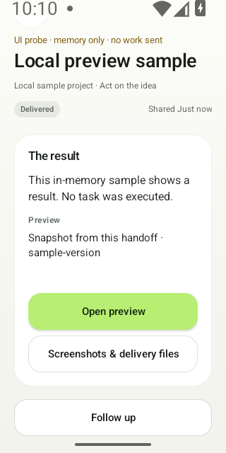
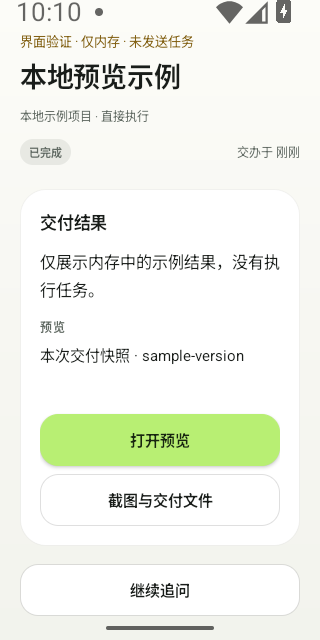

# One delivery surface — October 5, 2026

The result, preview state and inspection actions now share the existing result
card. Follow-up, approvals and the full report remain separate. This source
refinement follows [delivery clarity](ui-delivery-2026-10-05.md); the unchanged
[0.5.3-rc.1 download](0.5.3-rc.1.md) and dated website/README tours predate it.

## Design and behavior

The earlier native captures split the summary, preview explanation and buttons
across separate surfaces. The new grouping gives one reading sequence: result,
available evidence, then inspection. It reuses the existing opaque card and its
20dp padding. Fonts, text, preview states, callbacks, permissions and action
eligibility are retained. No decorative animation, nested card or placeholder
image is introduced. When no report exists, the actual progress state remains;
the grouping does not fabricate a completed result.

The existing verified thumbnail or its error moves into this surface. Its source,
validation and opening path are unchanged; this diagnostic has no thumbnail and
does not verify a genuine screenshot. Existing approvals, follow-up, full-report
disclosure and stop/delete actions remain outside the card.

This applies [ADR0016](../decisions/0016-project-first-light-ux.md) to the result
page. The official [Materials](https://developer.apple.com/design/human-interface-guidelines/materials)
and [Motion](https://developer.apple.com/design/human-interface-guidelines/motion)
pages were read on October5: content needs a stable readable surface; material
and motion should explain structure or feedback. These are product-local design
choices, not a claim that Android implements native Liquid Glass or Apple-level
quality. This grouping adds no new motion.

## Actual native UI captures

**Readonly memory probe, not a returned task.** The visible marker says
“UI probe · memory only · no work sent”. These are uncropped320×640 captures of
the scrolled delivery region, from the tested development source. Some topbar
content is outside the captured viewport. Buttons were not activated. They do
not demonstrate actual Codex work, a working preview, the downloadable candidate
or the entire page. The links below switch with GitHub's viewer theme.

| English | 简体中文 |
| --- | --- |
| <picture><source media="(prefers-color-scheme: dark)" srcset="../../assets/brand/source-delivery-en-dark-20261005.png"></picture> | <picture><source media="(prefers-color-scheme: dark)" srcset="../../assets/brand/source-delivery-zh-dark-20261005.png"></picture> |

## Native and build evidence

The independent non-exported debug fixture uses readonly memory. API, credentials,
preference/file-store edits, task save, outbox, services, pairing, import and
business navigation are guarded. It models only display state. Instrumentation
alone writes diagnostic PNGs; no preview, files, follow-up or business action is
clicked.

Before the production change, the new structure check failed1/1 in2.159s:
Preview belonged to the page root rather than the result card. No PNG was
produced. The original failure, sources and APKs remain. After the grouping,
the complete native class passed **5/5**,27.65s (host28.6324866s):

- The original four method bodies and native-frame/geometry helpers are unchanged:
  78 semantic configurations, six normal layouts, four system-200%-text cases
  with12 individual reachability checks. Copy, primary/secondary styling, busy
  disabling and preview/reopen boundaries still pass.
- The new method checks24 combinations: English/Chinese × light/dark × normal/
  200% text × missing/unavailable/ready preview. All24 summaries are complete
  and reachable. The12 normal Preview-to-Follow-up regions fit the actual safe
  scroll viewport and physical screen together; the assertion was not weakened.
- At200% text,40 additional detail/action targets are checked individually with
  complete characters, no ellipsis and full bounds. Buttons are at least48dp.
  Larger content may require scrolling; the entire card need not fit at once.
- All12 normal raw PNGs were inspected individually. Device/host SHA-256 values
  match. The four public PNG copies above are byte-identical to those originals.
  Guard assertions report zero forbidden actions.

The green debug/test build passed39.5697109s; JVM24/24 passed without failures,
errors or skips. Lint reported0errors/30warnings. All94 source files match before,
after build and after native verification. Device settings stayed API35,
320×640/160dpi, system fontScale2.0, original animation scales and default IME.
Normal-text captures use only the diagnostic Activity's local fontScale1.0.

| Saved tested artifact | SHA-256 |
| --- | --- |
| TaskActivity.java | `4ac96db9f2f2be5ae81a70dd2c8f2aeb40ca5cab50e7c72ff4948a4de11a0537` |
| TaskPreviewFeedbackTest.java | `2939ea244ec001433da583b07449d661ff341f72c96e196da4fc285adf6b2bae` |
| Debug APK | `2d0579f9b853b2d3e3ee76154fbbb537fb7a0e70f653ca7659825cbf60e13fff` |
| Test APK | `fe57f9fe72cec22d0427015862c9163dc1b88e6439c940c3bd05989fe460dec1` |

Hashes refer to saved tested bytes, before Git line-ending normalization. Private
`.local/ux-oct5-delivery-surface/` contains the red/green sources, APKs, raw logs,
12 PNGs and readonly262-file inventory. The earlier130 host evidence files,
ten device PNGs and106 sealed red files remain unchanged.

A host record script failed by treating a later file modification time as the
ADB-read time. Its original error is preserved; no device clock offset is
inferred. Saved device-log ordering from the red/green instrumentation starts
through capture end has69 lines without a new ANR/FATAL exception. The crash
buffer is byte-identical before/after; earlier ANR records remain. No device
reset, setting change or test rerun was used to hide this record error.

Physical Android, TalkBack, real IME, motion-off, performance, real thumbnail/
preview, genuine Relay/Codex delivery and installation gates remain open. This
local grouping is not a stable-launch or marketing-readiness claim.
