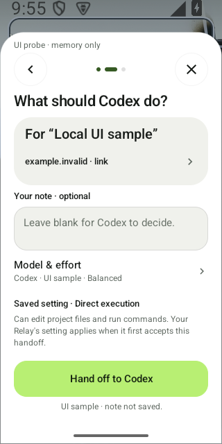
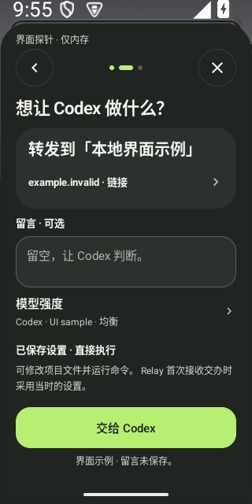

# Share confirmation: complete names first

Accepted local development, October7,2026. This source follows signed
[candidate16](0.5.16-rc.1.md); the public APK is unchanged.
[Selected verification](ui-share-name-first-2026-10-07.json).

1. **Identity — improved.** The complete20sp medium project name now leads
   its matte confirmation group. Removing the32dp decorative initial and12dp
   gap gives it248dp rather than204dp at320dp. Material stays directly below;
   the optional note, model, execution notice and primary action keep their
   existing meaning. Root and an independent reviewer directly accept both
   original font1 short-name views, including markers and system bars.
2. **Long-name reading — passes locally.** One12.754s native method closes
   two memory-only windows. English reads7lines, Chinese6; each reads all16
   distinguishing ID characters and reaches the whole52dp Send button without
   clicking it. The14fixed events plus13line events agree with the final
   summary, eight zero business guards and known destruction/executor drain.
   Font, language, theme and15palette values restore. Long names are assertion
   checks, without long-name or200% pixel acceptance.
3. **Verification — finite scope.** Build/install/native retain1/26/29
   returned-zero direct children,112raw streams, six source receipts and145
   frozen files. JVM27/27 passes; lint has0errors/29warnings. The retained-file
   reader separately reparses source, installed APK bytes, reports, stream and
   both PNG/JSON pairs. Its parsing rules match the reviewed protocol; it is
   not an independently authored parser. Pixel flags remain false; separate
   direct visual reviews accept these two stills.

The original baseline remains failed:6.859s, one English short-name capture
receipt, then a long-name ordering assertion and known destruction. No Chinese
window or image transfer completed. The fresh successor changes the reviewed
production hierarchy and adds an error message to that same assertion; no
assertion or frame wait is relaxed. Passing the new layout does not establish
whether the old failure was layout or sampling.

No Send, business input, pairing, API, persistent draft, genuine catalog,
process recovery or OS/IME write occurred. The existing debug fixture and
manifest are unchanged. This does not establish continuous animation, every
button, keyboard/IME behavior, TalkBack, physical performance, real submission
or signed-App acceptance. Genuine release gates and marketing handover remain
open.
