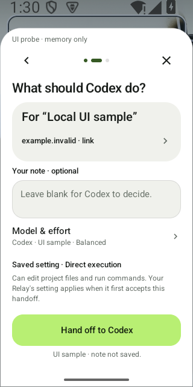
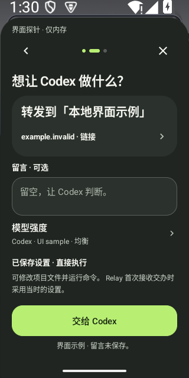

# Share sheet: quieter navigation controls

Local development, October 7, 2026.
[Selected verification](ui-share-quiet-chrome-2026-10-07.json).
Both original EN/light and ZH/dark normal-font captures are retained and were
directly accepted by root and an independent reviewer. The public image paths
below are byte-exact repository copies of those originals.

Only the idle appearance of Share's Back and Close buttons changes: their
circular fill becomes transparent and their idle stroke is removed. This lets
navigation sit behind the project identity, material and next action in the
visual hierarchy. The sheet remains opaque. The shared native Views
implementation gains `Ui.sheetIconButton`; ordinary `Ui.iconButton` keeps its
existing default, including the Home settings gear.

The disabled, pressed and focused drawable definitions remain byte-identical.
The icon tint, descriptions, callbacks, 48dp targets and `bindPress` call are
preserved in source. That source comparison does **not** establish fresh
runtime feedback or keyboard-focus acceptance for the two Share controls.
This take neither clicks them nor measures their interactive states.

The unchanged
`ShareDestinationReadingTest#nameFirstConfirmationKeepsIdentityReadable`
passes in 13.248s with two memory-only, font1 windows. English reads seven
long-name lines and Chinese six; each reads all 16 distinguishing ID characters
and reaches the whole 52dp Send target without clicking. The 27 events and
23 zero-guard snapshots agree with two known `DESTROYED` windows, terminated
executors and restored statics. These are long-name reading assertions; the
two actual PNGs show the short-name, blank-note state.

Build/install/native retain 1/26/29 returned-zero direct children, 112 raw
stdout/stderr files, six matching source receipts and 146 frozen source/config
files. The reports contain 27 JVM tests with no failures, errors or skips, and
lint reports 0 errors/29 warnings. A separate retained-file reader passes,
rehashing the source, APKs, reports and both PNG/JSON pairs. Its native parsing
rules retain the reviewed protocol; it is not an independently authored
algorithm. Machine pixel flags remain false. Separate direct reviews accept
the two originals' quieter idle controls, complete visible content, memory-only
markers and system-bar pixels.

Byte-exact repository copies, 320×640 each:

No new baseline, test, fixture or wait was introduced for this change. No Send,
genuine catalog/API, pairing, persistent draft or OS setting write was exercised.
This record does not establish whole-page or 200% pixels, keyboard/IME behavior,
TalkBack, physical performance, continuous motion, signed-package or website
acceptance. Older results are not promoted into evidence for this source.
